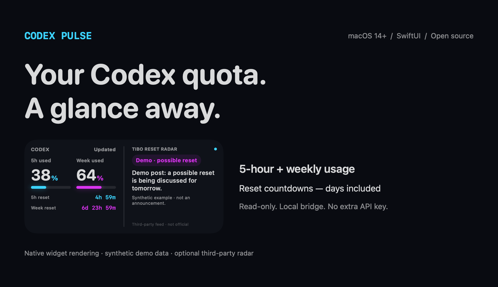

# Codex Pulse

**Your Codex quota. A glance away.**

A native macOS desktop widget for **5-hour and weekly usage**, with separate reset countdowns — days included.

[Download v0.1.1](https://github.com/18637168668a-cpu/codex-pulse/releases/tag/v0.1.1) · [简体中文](README.zh-CN.md) · [Install](#quick-start) · [Security](SECURITY.md) · [Contribute](CONTRIBUTING.md)



*Rendered from the actual SwiftUI views. All numbers and posts above are synthetic demo data.*

[](https://github.com/18637168668a-cpu/codex-pulse/actions/workflows/ci.yml)
[](LICENSE)


## Why this exists

I wanted to glance at my desktop and know two things: **how much have I used, and when does each limit reset?** A weekly countdown that only shows hours isn't enough. A browser tab isn't a desktop widget.

Codex Pulse keeps the answer small, readable, and on the desktop.

- **Used, not remaining:** 5-hour and weekly percentages side by side.
- **Two reset clocks:** each quota has its own countdown, including days.
- **Native SwiftUI + WidgetKit:** small and medium widgets; English and Simplified Chinese follow your system language.
- **Read-only local bridge:** Node.js built-ins only. No Electron, web development server, telemetry, or extra API key.
- **Honest missing-data states:** unavailable values show `—`; cached values are labeled, never replaced by demo percentages.
- **Optional reset radar:** recent public posts from @thsottiaux, filtered with transparent text rules. Off by default. Not an official announcement service.

If this saves you a few trips to the usage page, a ⭐ helps other Codex users find it. Useful bug reports help even more.

## Quick start

**Download, open, enable the bridge, add your widget. No Xcode or Node installation needed.**

[Download v0.1.1 — DMG or ZIP](https://github.com/18637168668a-cpu/codex-pulse/releases/tag/v0.1.1)

> **Unnotarized prerelease:** the `unsigned` downloads have an ad-hoc signature, not an Apple Developer ID signature. macOS may block first launch. Only approve this specific app if you trust the download; see [first-launch guidance](docs/INSTALL.md). Intel and clean-Mac installation still need validation.

1. On **macOS 14+**, install Codex and sign in with your **ChatGPT account**. API-key-only login is not supported for quota display.
2. Download the DMG/ZIP and move **Codex Pulse.app** into **Applications** (or your user Applications folder).
3. Open Codex Pulse and click **Enable/repair bridge**. It registers a local service that starts at login; no sudo or API key is needed.
4. **Right-click desktop → Edit Widgets → Codex Pulse → add small or medium.** You can close the companion app afterwards.

The app bundles the local bridge and Node runtime. Setup only runs when you click the button. The companion app runs outside App Sandbox for service setup; the widget remains sandboxed. [Security details](SECURITY.md).

<details>
<summary>Build from source instead</summary>

Requires full **Xcode 15+** (Command Line Tools alone are insufficient) and **Node.js 22+**. The local build uses an ad-hoc signature.

```bash
git clone https://github.com/18637168668a-cpu/codex-pulse.git
cd codex-pulse
bash scripts/install.sh --dry-run
bash scripts/install.sh
```

Source installs go to `~/Applications`. For a custom CLI location, set `CODEX_BIN=/absolute/path/to/codex`. Pull and rerun the installer to update a source installation.

</details>

For downloads, close the app, replace it in the **same Applications folder**, reopen it, and click **Enable/repair bridge**. Use **Remove local bridge** before moving the app to Trash. [Installation, upgrades and troubleshooting](docs/INSTALL.md).

## Optional reset radar

In the app, choose **Enable reset radar** and confirm the third-party request notice. Choose **Disable reset radar** to turn it off. Source installs also support:

```bash
bash scripts/social.sh on
# Later:
bash scripts/social.sh off
```

Opting in fetches a public third-party feed from [codex-reset.com](https://codex-reset.com). The provider receives a normal HTTPS request, including your IP address, **not your Codex credentials or quota data**.

The radar only considers recent links to @thsottiaux on X. It distinguishes **“possible reset”** from **“reset reported”**, rejects obvious negations, and links back to the post. These are keyword heuristics, not model-based predictions or proof that your account reset. The feed may lag, omit posts, or become unavailable. This project is not affiliated with its provider, X, or OpenAI.

## How it works

```text
Codex login → codex app-server → read-only localhost bridge → WidgetKit
                                 ↑ optional public feed
```

The bridge uses the documented [`account/rateLimits/read`](https://learn.chatgpt.com/docs/app-server#6-rate-limits-chatgpt) method and forwards only supported quota fields. It does not start model turns, read chats, redeem resets, or request purchases.

- Listens on `127.0.0.1:43187`; rejects foreign Host/Origin headers; no permissive CORS.
- Caches quota reads for 30 seconds and optional feed reads for 5 minutes, on demand.
- Requests a widget timeline refresh after 5 minutes and supplies minute-resolution countdown entries for an hour. **macOS controls actual refresh timing**; this is not second-by-second quota tracking. See [Apple's refresh guidance](https://developer.apple.com/documentation/widgetkit/keeping-a-widget-up-to-date).
- Saves the last sanitized widget payload in the widget's sandbox. Credentials remain managed by Codex. Other local processes can reach the loopback endpoint; it is not an authentication boundary.
- Shows only actual 300-minute and 10,080-minute windows. Unsupported or unavailable windows are not guessed.

## Development

No `npm install` is needed; the bridge has no package dependencies.

```bash
npm test                       # bridge, privacy boundaries, failure and radar tests
bash scripts/test-native.sh    # countdown tests + EN/ZH rendered layout previews
bash scripts/build.sh          # local native app build + signature verification
```

| Directory | Purpose |
| --- | --- |
| `native/` | SwiftUI companion app and WidgetKit extension |
| `bridge/` | Restricted stdio client, local HTTP service, optional feed filter |
| `scripts/` | Local build, install, uninstall and radar toggle |
| `tests/` | Synthetic fixtures only; no login required for automated tests |

## Status & roadmap

This is an early, deliberately small prerelease. The native build architecture is prepared for universal distribution; Intel installation and clean-machine support remain pending validation. There is no App Store distribution or notarized binary.

Next priorities: clean-machine/Intel testing, better installation diagnostics, accessible larger-text layouts, and additional languages. Feature requests and reproducible reports are welcome; please remove account data from screenshots and logs.

Built with Codex, refined from daily use. [MIT licensed](LICENSE). Independent community project; Codex and macOS belong to their respective owners.
