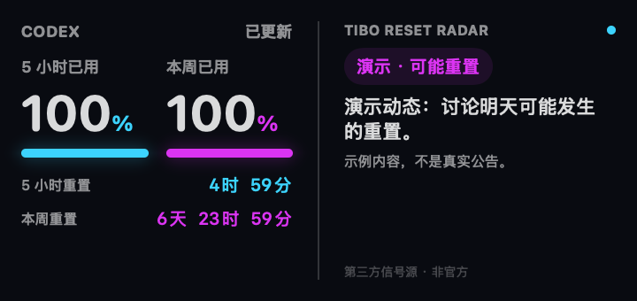

# Codex Pulse

**Codex 额度，抬眼即见。**

原生 macOS 桌面小组件：并排展示 **5 小时已用量、本周已用量**，分别显示重置倒计时，超过一天明确显示天数。

[English](README.md) · [安装与排查](docs/INSTALL.md) · [隐私与安全](SECURITY.md)



*由实际 SwiftUI 界面渲染；截图中的用量和动态都是演示数据，不是真实公告。*

## 为什么做这个

想知道额度用了多少、什么时候恢复，不应该每次打开一个网页。这个项目来自一个很具体的日常需求：在桌面留一小块地方，把两组额度和两个重置时间说清楚。

- 百分比统一表示**已用量**，不是剩余量。
- 原生 WidgetKit，小号和中号，跟随系统显示中英文。
- 本机只读服务，Node 内置模块即可，不需要 Electron、网页开发服务器或额外 API Key。
- 无数据显示 `—`，旧数据显示“缓存”，不使用演示数字冒充实时数据。
- Tibo 重置信号雷达可选、默认关闭；文本规则判断，不是 AI 预测，也不代表账户已重置。

如果它也解决了你的问题，欢迎给一个 ⭐；安装反馈和可复现的 bug 同样有帮助。

## 安装

**v0.1 是源码构建预览版，不是签名公证好的即装即用 App。**

需要 macOS 14+、完整 Xcode 15+、Node.js 22+，以及已通过 ChatGPT 账号登录的 Codex CLI 或桌面 App。只安装 Command Line Tools 不够。已在 Apple Silicon / Xcode 26.4 本机验证构建；Intel 和其他干净机器仍需要测试反馈。

```bash
git clone https://github.com/18637168668a-cpu/codex-pulse.git
cd codex-pulse
bash scripts/install.sh --dry-run
bash scripts/install.sh
```

脚本本机构建并临时签名，安装到 `~/Applications`，注册登录时启动的本机后台服务。无需 sudo，不要求你的 Apple 开发证书，也不会覆盖不同标识的同名 App。

最后：**右键桌面 → 编辑小组件 → 搜索 Codex Pulse → 添加小号或中号**。位置需要通过系统界面添加，之后可以关闭主应用。

### 可选雷达

```bash
bash scripts/social.sh on
bash scripts/social.sh off
```

开启后访问第三方公开源 [codex-reset.com](https://codex-reset.com)，它会收到你的 IP 等普通 HTTPS 请求信息，但不会收到用量、登录凭证或聊天。只分析最近七天、链接指向 @thsottiaux 的动态。规则可能误判、漏报，第三方源也可能延迟或停止；所有判断均不应视为官方确认。

### 卸载

```bash
bash scripts/uninstall.sh
```

应用、后台脚本和 LaunchAgent 会移到废纸篓，可恢复；不会删除 Codex 登录资料。桌面小组件需要手动移除，系统管理的组件缓存可能继续保留。

## 刷新与限制

本机接口按需读取，额度缓存 30 秒；组件请求约 5 分钟刷新，并预先提供分钟级倒计时。**实际刷新由 macOS 调度，不承诺秒级实时。**“刷新组件”按钮也是向系统发出刷新请求。

接口只返回额度百分比、窗口长度、重置时间等必要字段。无模型调用、自动重置、消费、聊天读取或遥测。只支持识别到的 300 分钟和 10080 分钟额度窗口，不猜测不存在的数据。

服务仅监听 `127.0.0.1:43187`，限制 Host/Origin；本机其他进程仍可访问，不能当作本机用户间的安全隔离。

## 参与改进

```bash
npm test
bash scripts/test-native.sh
bash scripts/build.sh
```

优先欢迎干净机器安装反馈、Intel 验证、无障碍与翻译贡献。提交截图前遮盖个人信息。代码采用 [MIT 许可证](LICENSE)，是独立社区项目，与 OpenAI、Apple、X 及信号源无隶属关系。
