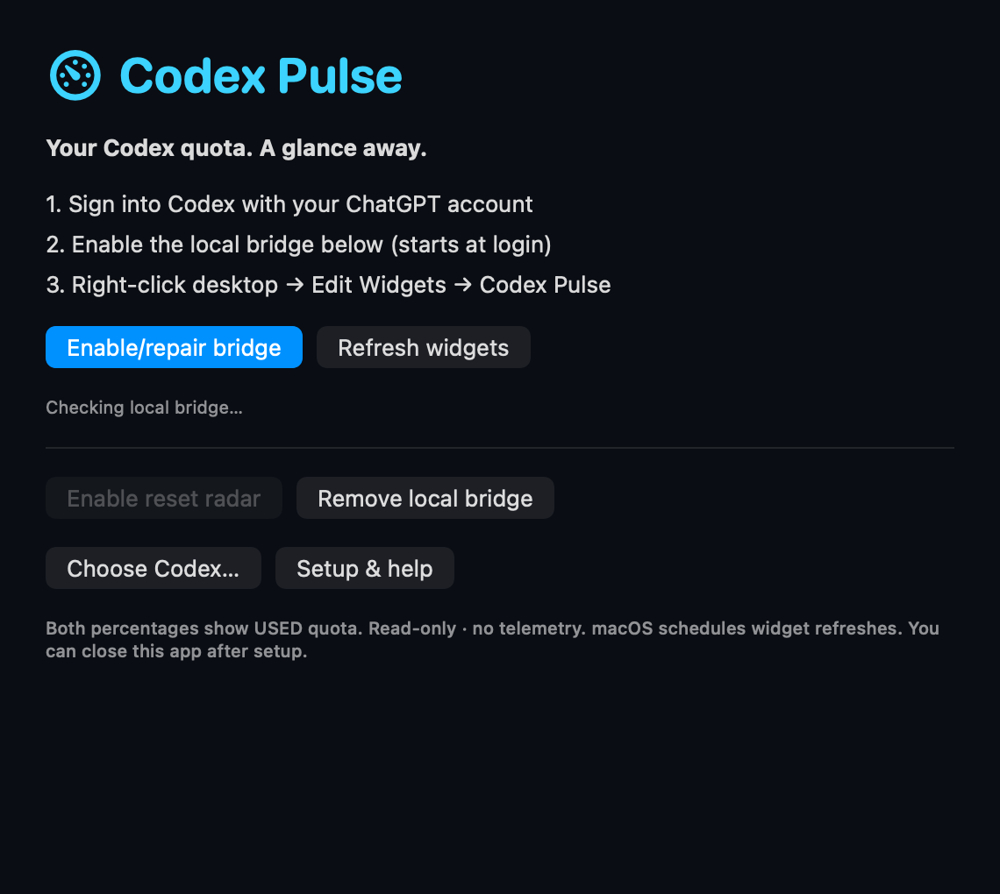

# Installation & troubleshooting

## Downloaded prerelease (v0.1.1)

[Download the v0.1.1 DMG or ZIP](https://github.com/18637168668a-cpu/codex-pulse/releases/tag/v0.1.1). This is an ad-hoc signed, unnotarized prerelease. The universal app bundles Node.js and the bridge. Intel installation and clean-machine support remain pending validation.

Move the app to `/Applications` or `~/Applications` before opening it. On first launch, the non-sandboxed companion app asks you to click **Enable/repair bridge**. This user-triggered action installs or repairs the per-user LaunchAgent; the WidgetKit extension remains sandboxed. **Remove local bridge** removes that service while retaining the app. The radar is off by default; use **Enable reset radar** or **Disable reset radar**.

If macOS says the developer cannot be verified, first confirm you downloaded from this repository and check the checksum. If you trust it, use **System Settings → Privacy & Security → Open Anyway** for this app, following [Apple’s unnotarized-app guidance](https://support.apple.com/en-us/102445). If macOS reports malware or that the app will damage your computer, **stop and do not override the warning**. Do not disable global protections or remove quarantine attributes. Managed Macs may prohibit exceptions.

Codex must already be installed and signed in with ChatGPT. If it is not detected, click **Choose Codex…** to select its executable, then retry setup. The download includes Node; no developer tools are required.

After setup, right-click your desktop → Edit Widgets → Codex Pulse. Placement is a macOS step, not automatic.

## Update a download

Close Codex Pulse, replace the app in the same Applications folder, reopen it and click **Enable/repair bridge**. Keep the install location unchanged so the login service can find its bundled runtime. When changing from a source install in `~/Applications` to `/Applications`, remove the old bridge and app first to avoid duplicate widgets.

## Verify a download

Download `SHA256SUMS.txt` alongside both assets. In that download folder run `shasum -a 256 -c SHA256SUMS.txt`. If you downloaded only one asset, the missing other file is expected; the downloaded file must say OK. Checksums detect corruption but do not authenticate the publisher.



*Rendered from the real SwiftUI setup view; this is not a clean-Mac installation test.*

## What gets installed

| Item | Location |
| --- | --- |
| App and WidgetKit extension | `/Applications/Codex Pulse.app` or `~/Applications/Codex Pulse.app` (source default) |
| Bridge and install settings | `~/Library/Application Support/Codex Pulse OSS/` |
| User LaunchAgent | `~/Library/LaunchAgents/io.github.codexpulse.bridge.plist` |
| Local endpoint | `http://127.0.0.1:43187` |

Only a logged-in user's service is installed. No root service, firewall rule or global security change is needed. `install.sh --dry-run` checks tools, existing app identity and port availability without installing. It does not verify your account login or claim full clean-machine compatibility.

## Source fallback prerequisites

Install full Xcode from Apple, open it once and complete its first-run setup. Ensure `xcodebuild -version` resolves to that Xcode; selecting a different developer directory is a system setup choice you perform yourself.

Install Node.js 22 or later and sign into Codex normally. For a CLI installation, use `codex login` with your ChatGPT account. If no binary is on PATH, the bridge checks the standard Codex and ChatGPT app resource paths. Override with `CODEX_BIN=/absolute/path/to/codex` if necessary. If you intentionally use a non-default `CODEX_HOME`, set it during installation; it is kept only in your local install settings.

Run the commands in the [README](../README.md#quick-start), then add the widget through the macOS desktop widget gallery. The app can be closed; the LaunchAgent keeps the bridge available at login. Your Mac must be awake and online for fresh account data.

## Common problems

**Widget missing from the gallery:** open the installed app once, close/reopen the gallery, and search “Codex Pulse” or “Codex Usage”. If still missing, check the extension registration with:

```bash
pluginkit -m -A -D -i io.github.codexpulse.app.widget
```

**No data / cached:** open Codex Pulse and use Refresh widgets. Verify you are signed into Codex with ChatGPT rather than an API-key-only session. An unsupported quota window remains unavailable, not zero. Check the bridge without exposing credentials:

```bash
curl http://127.0.0.1:43187/health
curl http://127.0.0.1:43187/api/local/usage
```

The second command prints personal usage values. Do not paste them publicly without reviewing them. A 503 means the bridge could not obtain supported quota data; it is not proof that your quota is exhausted.

**Countdown is waiting/updating:** the cached reset timestamp has passed. A new account read is needed. The app does not assume your quota reset just because the clock reached zero.

**Old layout after update:** close the companion app, reopen it, and request refresh. If needed, remove and re-add the widget. macOS can retain rendered timelines. Do not disable system security or kill unrelated system services to refresh a widget.

**Port conflict:** stop the other service or choose another port in both the native source and bridge configuration, then rebuild. The packaged native app expects port 43187. `PULSE_PORT` by itself only changes the standalone bridge.

**Node or Codex moved after an upgrade:** click Enable/repair bridge (download), or rerun the installer (source) to update the LaunchAgent's absolute executable paths. If another unrelated app already uses the install location, move it aside manually; the installer will not overwrite it.

**Signing warnings:** source builds and `unsigned` downloads use ad-hoc signatures, not Apple notarization. If your managed Mac blocks local builds, follow your organization's policy; this project does not provide a security-bypass script.

## Manual development mode

```bash
node bridge/server.mjs
# In another terminal:
bash scripts/build.sh
```

This starts no LaunchAgent. `PULSE_SOCIAL=1 node bridge/server.mjs` explicitly enables third-party feed requests. Do not run a second bridge on the installed service's port.

## Remove

For downloads, click **Remove local bridge**, quit the app, move it to Trash, and remove the desktop widget. Codex login is untouched. Source installations can also run:

```bash
bash scripts/uninstall.sh
```

The managed app, bridge directory and LaunchAgent are moved to a timestamped folder in Trash. They can be recovered; reinstallation is the simplest way to start again. Codex credentials are not touched. Remove the desktop widget separately. macOS may retain the widget sandbox's last-known sanitized payload after removal.

Build output and runtime cache live under `build/`; packages live under `dist/`. Build staging is cleaned automatically. Native preview renders use temporary `codex-pulse-preview.*` directories. These are not part of the repository or the running installation.
